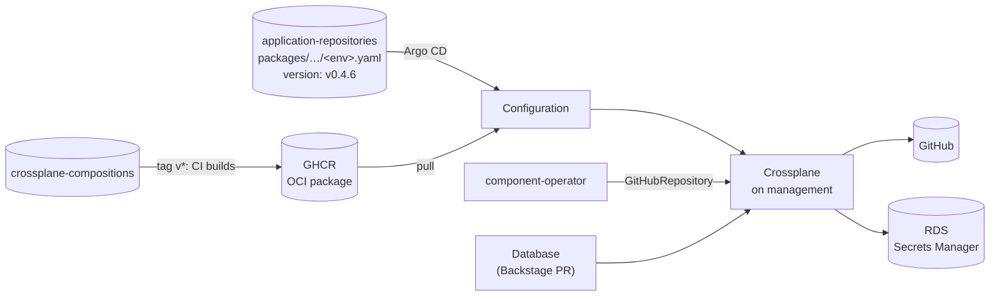

# crossplane-compositions

The platform's infrastructure APIs, written as Crossplane compositions and
released as one versioned OCI package. A developer, or a platform operator,
asks for a small namespaced resource. Crossplane turns it into real GitHub or
AWS resources.

| API | Asks for | Becomes |
|---|---|---|
| `GitHubRepository` (`repo.taskapp.io/v1alpha1`) | a repository for a component | a GitHub repository, plus a push webhook to Argo CD |
| `Database` (`database.taskapp.io/v1alpha1`) | Postgres for a component in an environment | an RDS instance, with its connection details published to AWS Secrets Manager |

## Where it fits



The delivery has three parts, each in its own repo:

```
crossplane-compositions   → what can be released   (this repo, OCI packages)
application-repositories  → which version runs where (one file per environment)
argocd                    → how it's delivered      (the taskapp-packages ApplicationSet)
```

Publishing a new version deploys nothing. An environment moves to it only
when its file in
[application-repositories](https://github.com/entr0pian/application-repositories)
changes `version`.

## `GitHubRepository`

Created and owned by [component-operator](https://github.com/entr0pian/component-operator)
for every `Component`. It composes, through `provider-upjet-github`:

- **`Repository`** with the requested name and visibility, created with an
  initial commit so [scaffold-operator](https://github.com/entr0pian/scaffold-operator)
  can write the scaffold on top.
- **`RepositoryWebhook`** to Argo CD, so a push to the new repository syncs
  within seconds. It doesn't count towards readiness: the webhook only speeds
  things up over polling, so it must never block scaffolding.

## `Database`

```yaml
apiVersion: database.taskapp.io/v1alpha1
kind: Database
metadata:
  name: payments-db
  namespace: dev               # the environment
spec:
  componentRef: {name: payments}
  dbName: paymentsdb
  size: small                  # small | medium | large
status:
  exports:
    - name: connection
      type: Secret
      location: {provider: aws-secrets-manager, key: /bindings/dev/databases/payments-db}
      ready: true
```

Callers choose only the component, the database name and a size. Region, VPC,
engine and instance class are fixed by the composition. It composes a security
group and rule, a subnet group, the RDS instance, and, through
`provider-kubernetes`, a connection Secret plus an External Secrets
`PushSecret` that publishes it to Secrets Manager at a deterministic path.

The database doesn't decide who may use it. A `Release` binds it, and
[release-operator](https://github.com/entr0pian/release-operator) writes only
the Secrets Manager path into the service's values. The service's chart then
reads the credentials with its own ExternalSecret on the workload cluster, so
credentials never pass through Git or the operators.

## Design choices

- **Packages, not raw YAML.** Crossplane's package manager versions the APIs and
  resolves their providers and functions from `crossplane.yaml`. Argo CD
  applies one small `Configuration` per environment, through the
  `charts/configuration-installer` chart.
- **Small, opinionated APIs.** `size` maps to an instance class inside the
  composition. Exposing every RDS field would push infrastructure decisions
  back to developers.
- **Producers publish, consumers bind.** `Database.status.exports` says where
  its connection details live. A `Release` decides which service gets them.
- **Namespace-prefixed AWS names.** XR names are unique per namespace, AWS names
  per account. Prefixing with the namespace lets `dev/payments-db` and
  `prod/payments-db` coexist.

## Releasing

Push a tag `v*`, and `release.yaml` builds the package and pushes
`ghcr.io/entr0pian/crossplane-compositions:<tag>`. `validate.yaml` builds the
package and lints the installer chart on every pull request. Provider
credentials come from `crossplane-provider-config` in
[helm-charts](https://github.com/entr0pian/helm-charts), not from this package.

```sh
git tag v0.4.7 && git push origin v0.4.7
```

To build locally (the `crossplane` CLI's `--ignore` doesn't support recursive
globs, so the non-package files are listed one by one):

```sh
crossplane xpkg build --package-root=. --examples-root=examples \
  --package-file=crossplane-compositions.xpkg \
  --ignore="charts/configuration-installer/Chart.yaml,charts/configuration-installer/values.yaml,charts/configuration-installer/templates/configuration.yaml,.github/workflows/validate.yaml,.github/workflows/release.yaml"
```
